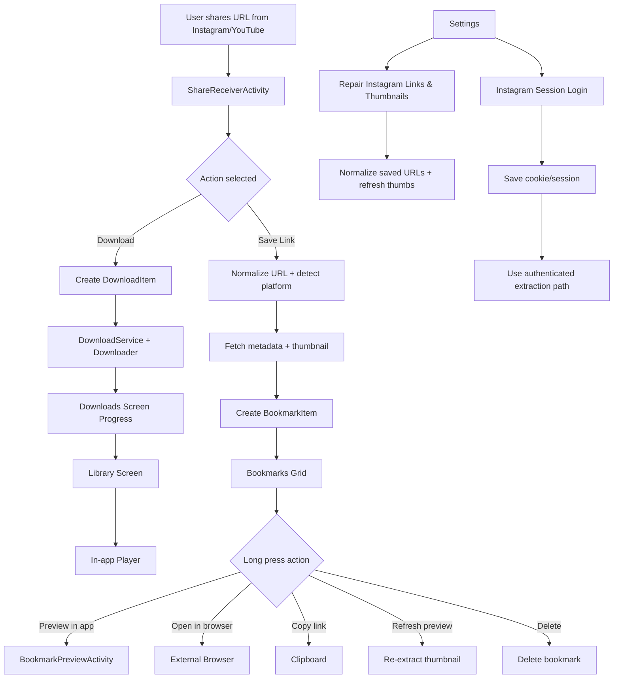
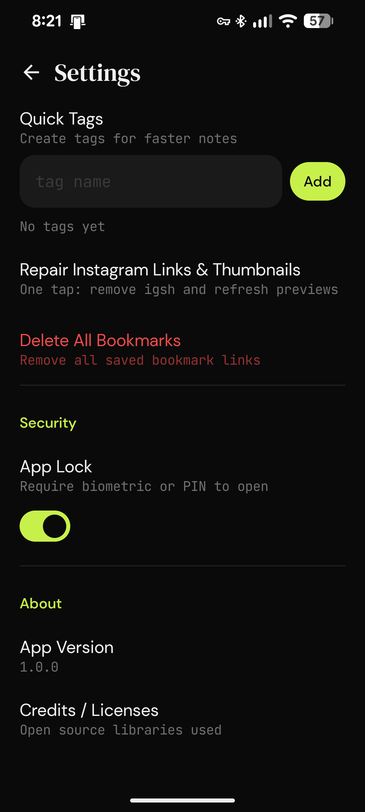

# VaultDrop (Post-downloader)


VaultDrop is an Android app built in Kotlin + Jetpack Compose for saving and managing media links from Instagram and YouTube, with built-in downloading, bookmarking, and preview workflows.

## Download APK

### Download Link

- [Download Latest APK](https://github.com/theallmyti/Post-downloader/releases/download/app/VaultDrop-arm64-v8a-debug-1.0.0.apk)


### GitHub Release Description

Use the following text when publishing a new release:

```md
VaultDrop is an Android app for downloading, bookmarking, and previewing Instagram and YouTube links.

Features:
- Download Instagram Reels, Posts, and Stories
- Download YouTube videos
- Save links as bookmarks with comments and tags
- Preview saved links inside the app
- Copy link, refresh preview, and delete from the bookmark menu
- Repair Instagram links and refresh thumbnails from Settings
- Optional Instagram session login for improved authenticated extraction

Highlights:
- Dark, minimal UI
- Bookmark grid with thumbnails
- Download queue and progress tracking
- Built-in media player
- Settings tools for bookmark maintenance

Installation:
1. Download the attached APK
2. Install it on your Android device
3. Allow installation from unknown sources if prompted

Notes:
- Android 8.0+ recommended
- Instagram results may improve after logging in from Settings
- Keep the app updated for the latest fixes and improvements
```

## Overview

VaultDrop focuses on a clean mobile-first workflow:
- Share an Instagram/YouTube link to VaultDrop
- Choose Download or Save Link
- Track progress in Downloads
- View media in Library
- Manage saved links in Bookmarks (Vault)

The app includes:
- Download queue and progress tracking
- Bookmarks with thumbnail previews
- In-app preview flow for saved links
- Taggable notes for bookmarks
- Settings actions to repair links/thumbnails and clear data

## Core Features

- Share-receiver flow (`ACTION_SEND`) for links
- Platform detection (Instagram, YouTube)
- Download management with status + progress
- Library and player viewers
- Bookmarks grid with search and quick actions
- Long-press context actions (preview/browser/copy/refresh/delete)
- URL normalization for Instagram share URLs (`igsh` cleanup)
- Thumbnail backfill and refresh logic for old bookmarks
- Settings-managed quick tags for bookmark notes
- Optional Instagram session login in-app for authenticated extraction

## Tech Stack

- Kotlin
- Jetpack Compose
- MVVM + Repository pattern
- Room (local persistence)
- Hilt (DI)
- Media3 / ExoPlayer
- Coil (image loading)
- Foreground service for downloads

## App Structure

```text
app/src/main/java/com/adityaprasad/vaultdrop/
  data/
    db/
    downloader/
    repository/
  domain/
    model/
    usecase/
  ui/
    home/
    downloads/
    library/
    bookmarks/
    player/
    share/
    settings/
```

## Flowchart



## UI Screenshots

### Home
<p align="center"></p>

### Downloads
<p align="center"></p>

### Library
<p align="center"></p>

### Bookmarks
<p align="center"></p>

### Settings (1)
<p align="center"></p>

### Settings (2)
<p align="center"></p>

## Setup

1. Clone the repository.
2. Open in Android Studio / VS Code with Android tooling.
3. Ensure Android SDK and Gradle are configured.
4. Build and run on API 26+ device/emulator.

```bash
./gradlew assembleDebug
```

Windows:

```bat
gradlew.bat assembleDebug
```

## Notes

- Instagram extraction behavior can vary by region/session/privacy.
- For some links, authenticated session improves media/thumbnail extraction.
- Settings includes maintenance actions for URL repair and thumbnail refresh.

---

Aditya Prasad
