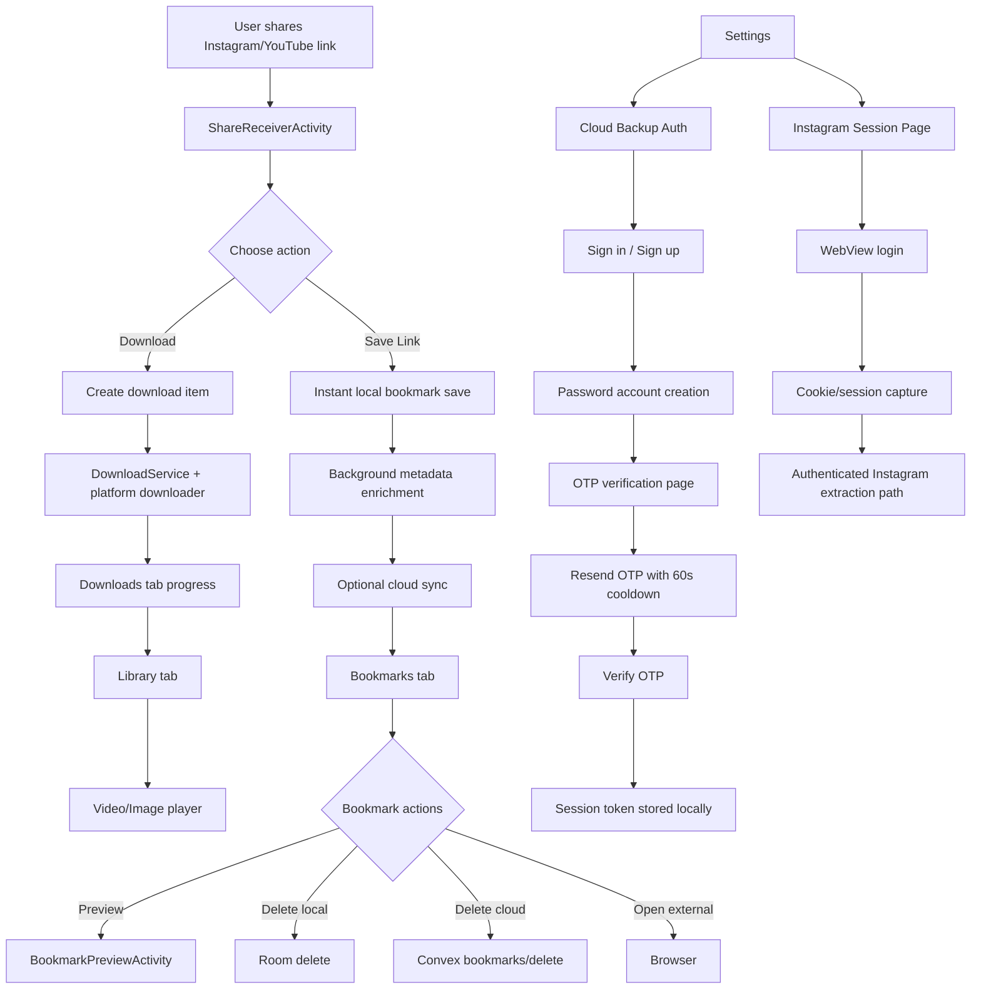
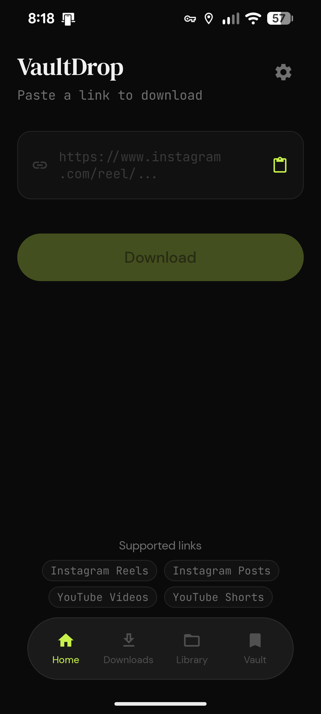
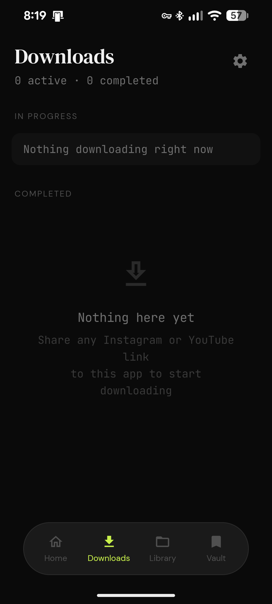
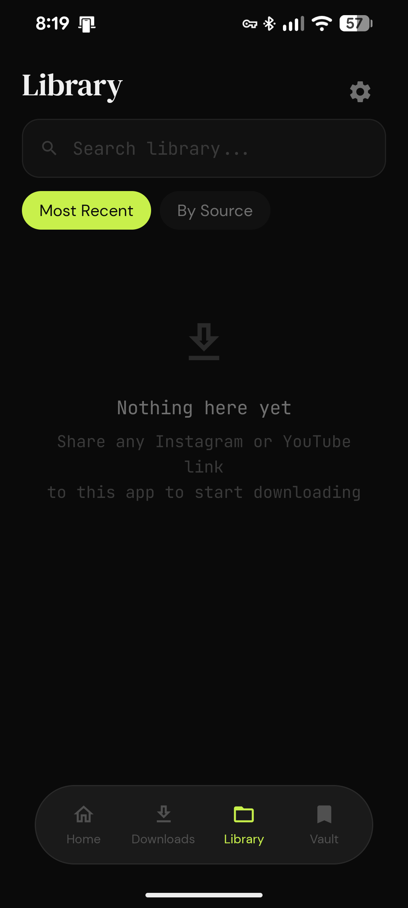
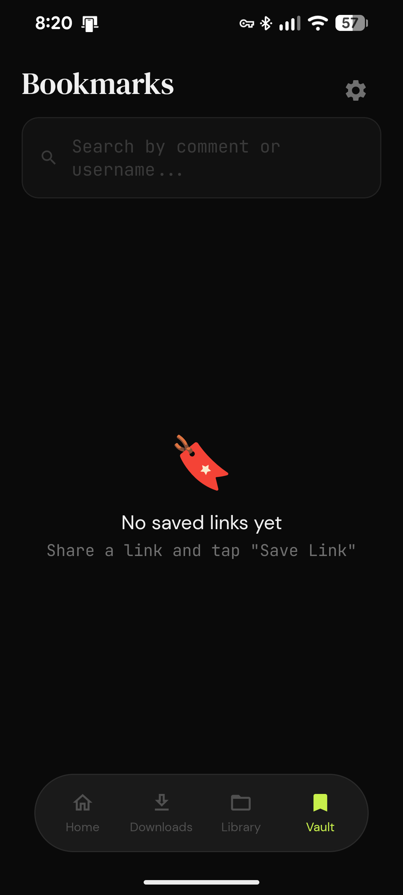
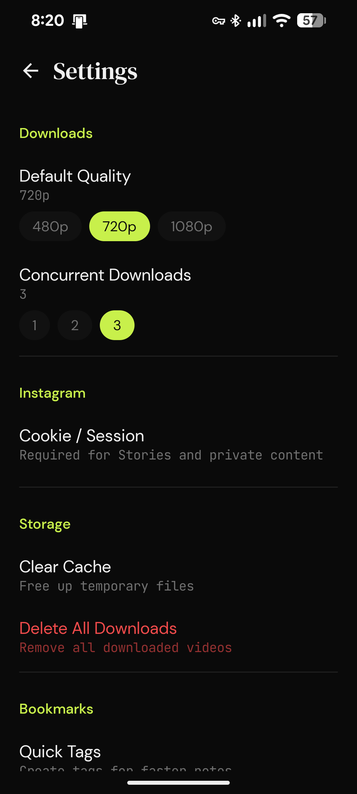

# VaultDrop


VaultDrop is an Android app for saving and downloading Instagram and YouTube content with a local-first experience, cloud bookmark sync, and in-app preview playback.

## Download

- [Latest APK](https://github.com/theallmyti/VaultDrop/releases/download/app/VaultDrop-arm64-v8a-debug-1.0.0.apk)
- [Project Website](https://theallmyti.github.io/VaultDrop/)

## Highlights

- Fast share-to-save flow (instant local save, background enrichment)
- Download queue with progress and final media in Library
- Bookmarks with tags, preview, and cloud sync
- Cloud backup account flow (password + OTP verification)
- Password reset via OTP
- Instagram session capture page for stronger extraction
- Resend OTP cooldown on UI and backend

## Tech Stack

- Kotlin + Jetpack Compose
- MVVM + Repository
- Room (local data)
- Hilt (dependency injection)
- Retrofit + OkHttp
- Media3 / ExoPlayer
- Convex backend (`convex.site` HTTP routes)
- Resend / SMTP mail path for OTP delivery

## Project Structure

```text
app/src/main/java/com/adityaprasad/vaultdrop/
  data/
    api/
    db/
    downloader/
    repository/
  domain/
    model/
    usecase/
  ui/
    auth/
    bookmarks/
    components/
    downloads/
    home/
    library/
    player/
    settings/
    share/
convex/
  auth.ts
  bookmarks.ts
  email.ts
  http.ts
  schema.ts
```

## App Flow Chart



## Auth and Cloud Backup Flow

- Sign in uses email + password.
- Sign up is a separate page.
- After create account, user moves to OTP verification page.
- OTP page shows entered email and an Edit action to return to sign-up form.
- Resend OTP is available with 60-second cooldown.
- Password reset also uses OTP.
- Successful auth stores token in shared preferences and enables cloud bookmark sync.

## Build and Run

1. Clone repo
2. Open in Android Studio or VS Code + Android tooling
3. Ensure Android SDK is installed
4. Set `convex.baseUrl` in `local.properties` if needed

```bash
gradlew.bat assembleDebug
```

For Kotlin compile check:

```bash
gradlew.bat :app:compileDebugKotlin --no-daemon
```

## Convex Backend Setup

1. Install dependencies

```bash
npm install
```

2. Configure deployment (`.env.local` should include `CONVEX_DEPLOYMENT`)
3. Push functions

```bash
npx convex dev --once
```

### OTP Mail Options

- SMTP (recommended for personal inbox sender):
  - `SMTP_USER`
  - `SMTP_PASS` (App Password)
  - `SMTP_FROM`
  - Optional: `SMTP_HOST`, `SMTP_PORT`, `SMTP_SECURE`
- Resend fallback:
  - `RESEND_API_KEY`
  - Optional: `RESEND_FROM`

## Screenshots

### Home
<p align="center"></p>

### Downloads
<p align="center"></p>

### Library
<p align="center"></p>

### Bookmarks
<p align="center"></p>

### Settings
<p align="center"></p>

## Notes

- Instagram behavior can vary by region, login state, and link privacy.
- If OTP fails, check SMTP/Resend env vars and redeploy Convex functions.
- For best OTP security, rotate app passwords when exposed.

## License

Apache 2.0
